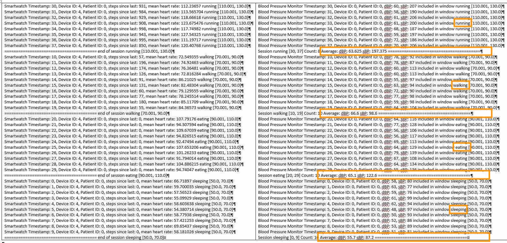
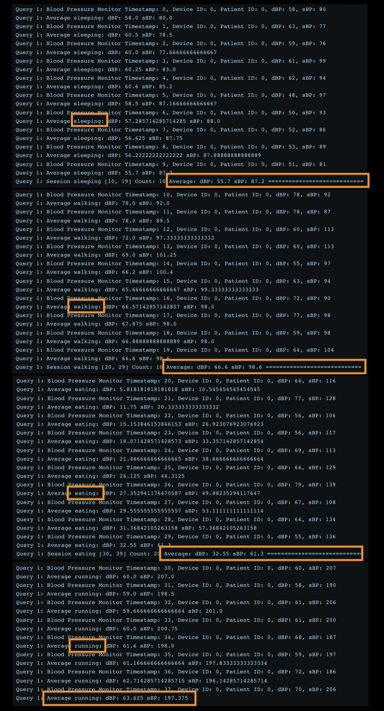
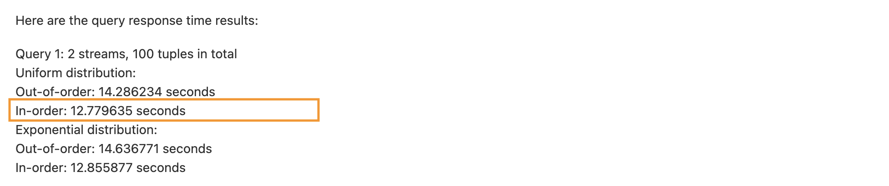
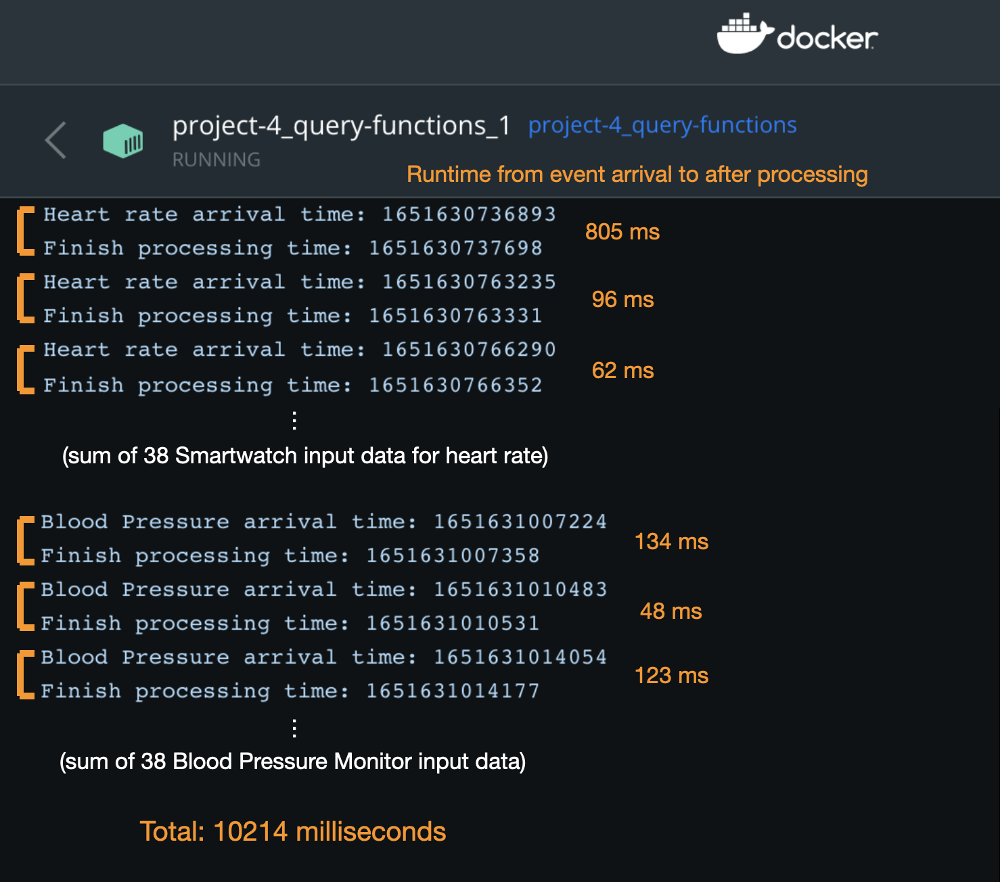

# A benchmark for digital health streaming analytics in Apache Flink and Stateful Functions (Team 4)

In the recent decade, real-time streaming analytics technology has dramatically improved medical analysis. It has resulted in a reduced workload for doctors. In addition, it helps build time efficient healthcare monitoring systems. This project aims to establish a benchmark system for the transpiring field of digital streaming analytics. This will serve as a baseline for evaluating the performance of an existing or newly developed system. We will implemented the benchmark of 4 Queries, and compared their performances. The primary programming language for this project is Java.

- Query 1 (Aggregations): computes the average Blood Pressure value over different activity periods (running, walking, sleeping)
- Query 2 (Anomaly Detection): compares the BP and glucose measurements current window average with the moving average and generates an alert if the difference is too high
- Query 3 (Pattern Detection): detects a sequence of events and raise an alert
- Query 4 (Identify Eating Period): in a period of time y where glucose rises by x%, (A) determine how often insulin is given within 15 minutes of this period, and (B) identify “activity” period (based on heart rate or steps) and compute how glucose drops compared to inactivity period

## Documentation of Frameworks Used

The main tools specified for this project are Flink DataStream API and Flink Stateful Functions.

Please check out:
- Flink DataStream API: [README_DatastreamAPI.md](README_DatastreamAPI.md)  
[Repository](https://github.com/BUicicchen/Digital-Health-Streaming-Analytics/tree/datastream-api)  
Repository: 
- Flink Stateful Functions: [README_StatefulFunctions.md](README_StatefulFunctions.md)  
[Repository](https://github.com/BUicicchen/Digital-Health-Streaming-Analytics)  

## Success Indicators

### ***1. Data Source***

Our data generator can generate data for multiple devices in the schema as presented in the Project Documentation.

- Smartwatch: < deviceID: int, timestamp: long, steps_since_last: int, mean_heart_rate: float >
- Blood pressure monitor: < deviceID: int, timestamp: long, dBP: int, sBP: int >
- Glucose monitor: < deviceID: int, minute: long, glucose (mg/dl): int >
- Fitbit: < deviceID: int, timestamp: long, METs: int, intensity: int, steps: int, heart_rate: int >
- Insulin tracker: < deviceID: int, timestamp: long, dose_amount: int >

It can also be configured with (1) different input distributions, such as in order and out of order, in uniform and exponential and (2) different frequencies of data emission.

### ***2. Query***

- Query 1:
The outputs from the Datastream API and Stateful Functions are consistent with each other.
>Average values from the experiment:  
>Sleeping: dBP: 55.7, sBP: 87.2  
>Walking: dBP: 66.6, sBP: 98.6  
>Eating: dBP: 65.1, sBP: 122.6  
>Running: dBP: 63.625, sBP: 197.375  

Datastream API:

Stateful Functions:

### ***3. Benchmark***

- **Runtime**:

We compared the runtime of Query 1 because our Datastream API and Stateful Functions have been tested to output the same result, so it is comparable.  
(One point in time both methods tested out the same hard-coded 38 events from Smartwatch and 38 events from Blood Pressure Monitor generated from the data generator (as shown in the pictures above). They output the same average values. However, by the time we are calculating the runtime, Datastream API have been modified to get data from random data generator and is facing some issues when inputing the hard-coded data)  
(One other thing to note is, Datastream API uses a sleep funciton of 150 milliseconds = 0.15 seconds to slow down the data stream for better visualization, since the sleeping function is used for each tuple generated, and there are 2 streams running at the same time, each stream produces 50 tuples, therefore the total sleep time is approximately 50*0.15 = 7.5 seconds)

Thus, the dataset used to calculate the runtime is different, but following the same distribution: Uniform In-Order Distribution.

**Datastream API has a runtime of *12.779635-7.5 = 5.279635 seconds over 100 tuples* and Stateful Functions has a total runtime of *10.214 seconds over 76 tuples*.**

Datastream API runtime computation:  

Stateful Functons runtime computation:  
(runtime print statements are commented out in RouterFn.java and AverageBloodPressureFn.java files)

Based on the runtime, we also calculated the throughput.

- **Throughput**:

Throughput = total number of events processed / runtime  

**Datastream API has a throughout of (100 tuples / 5.279635 seconds) ≈ *18.9407 tuples/second* and Stateful Functions has a total runtime of (76 tuples / 10.214 seconds) ≈ *7.4407 tuples/second*.**

#### Analysis
Datastream API (18.9407 tuples/second) has a higher throughput than Stateful Functions (7.4407 tuples/second), as we analyzed could potentially be because of the additional amount of time needed to put and pull data from RocksDB. Also, Flink is optimized for in-memory state access in the Datastream API implementation, and we used value state a lot in the queries. Futhermore, Stateful Functions also requires additional memory usage in RocksDB compared to Datastream API. On the other hand, due to the event-driven nature of Stateful Functions, it is very easy to implement different Queries using the same incoming resources. Overall, there are tradeoffs between the two implementations: Datastream API seems to have higher time and memory performance, and Stateful Functions help make sharing resources easier!

---
## Conclusion
We really enjoyed the process of development! Through cooperation and discussion, although not perfect, we have implemented 4 Queries that could be used on streaming digital health data, as well as analyzed the performances of Apache Datastream API and Stateful Functions.
