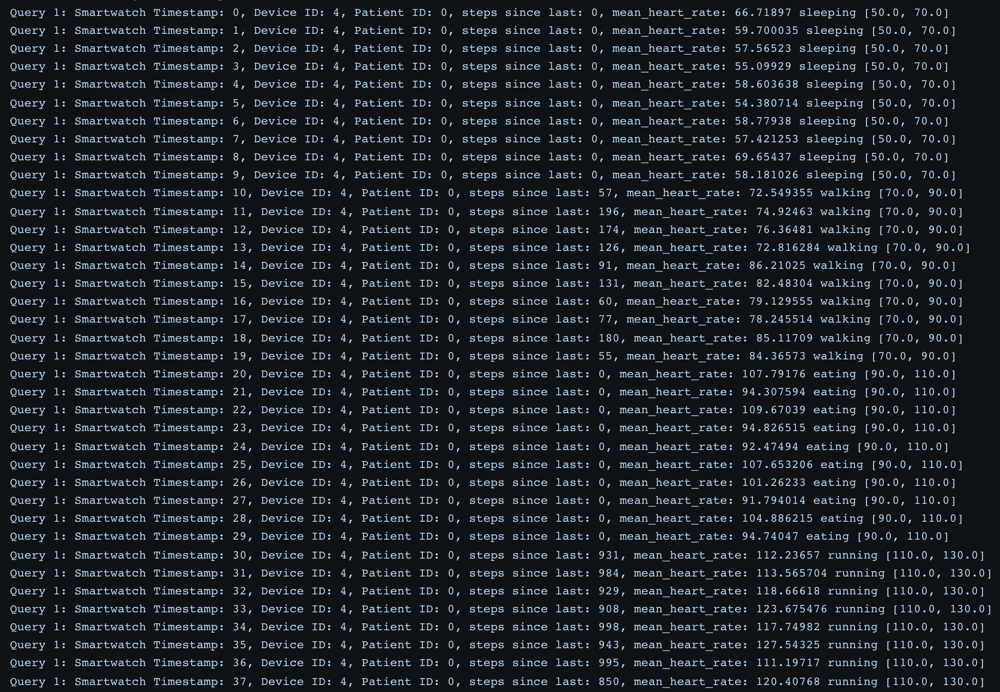
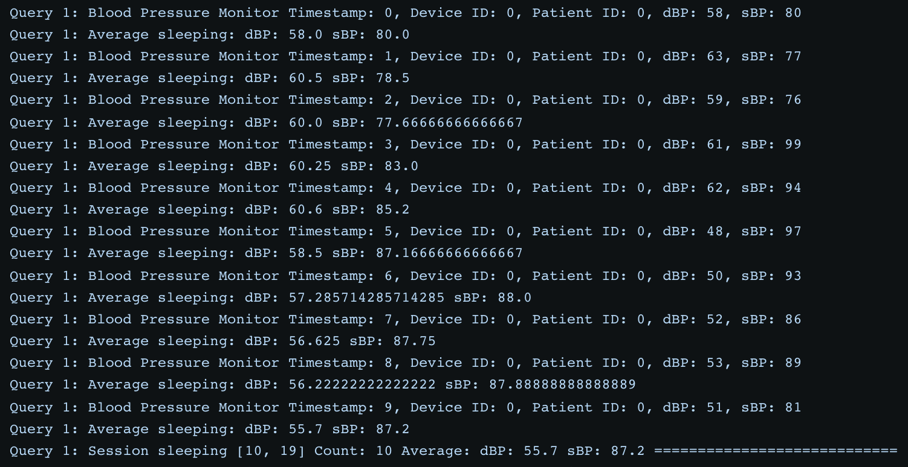
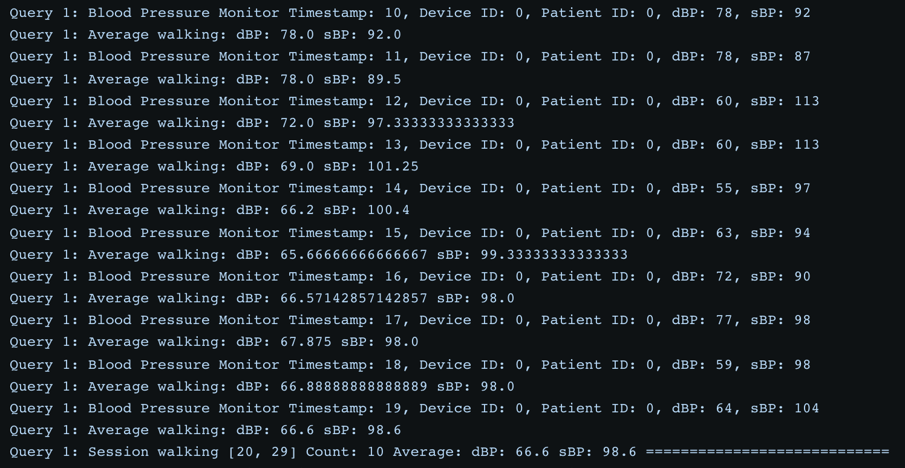
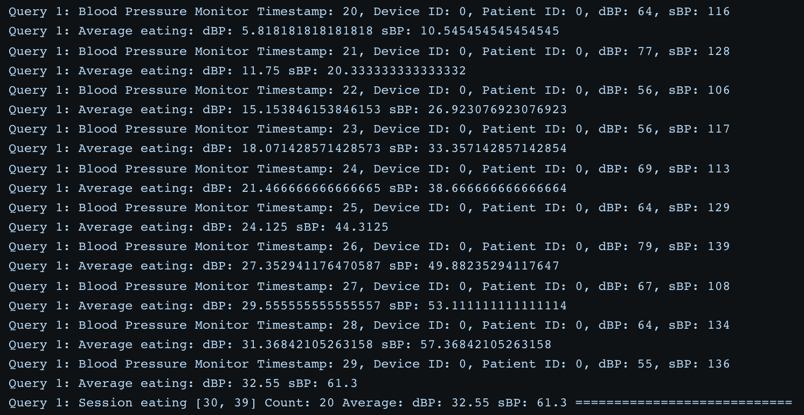
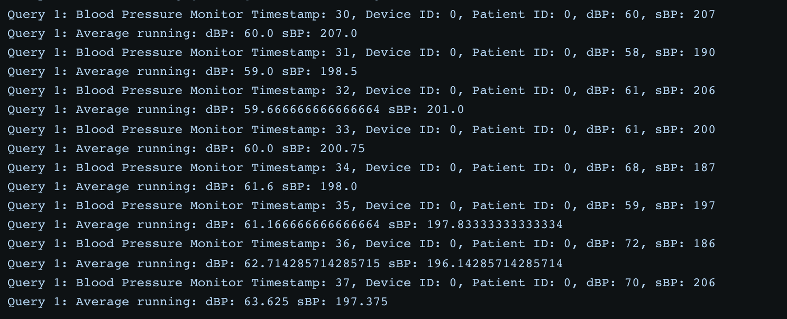
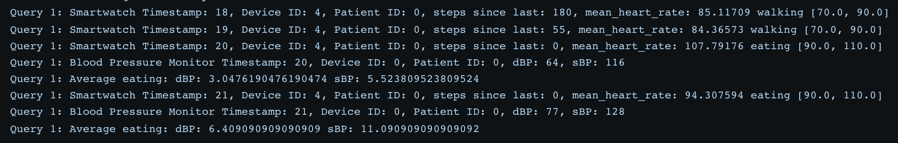
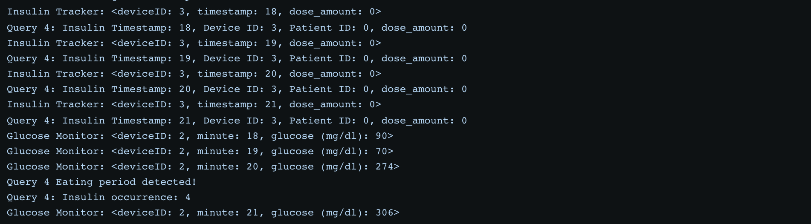
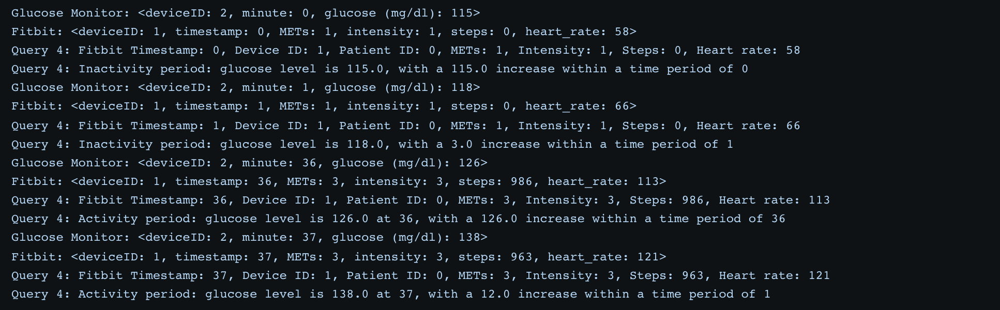

# Stateful Functions

#### Implemented by Yumiao Zhou: Queries (2) Anomaly Detection (3) Pattern Detection
#### Implemented by Cici Chen: Queries (1) Aggregations (4) Identify Eating Period

## Directory structure

`src/`, `pom.xml` and `Dockerfile`: These files and directories are the contents of a Java Maven project which builds
our functions service, hosting the application behind an HTTP endpoint. Check out the source code under
`src/main/java`. 

The `Dockerfile` is used to build a Docker image for our functions service.
- `module.yaml`: The Module Specification file to be mounted to the StateFun runtime process containers. This
  configures a few things for a StateFun application, such as the service endpoints of the application's functions, as
  well as definitions of Ingresses and Egresses which the application will use.
- `docker-compose.yml`: Docker Compose file to spin up everything.

## Prerequisites

- Docker
- Docker Compose

## Running the code

From this directory, execute:

```
$ docker-compose build
```

This pulls all the necessary Statefun Docker image, and also builds the functions service image. This can take a few minutes as it also needs to build the function's Java project.

Afterward the build completes, start running all the services:

```
$ docker-compose up
```


----


## Implementations, Testing, & Running Experiments

We were facing some challenges connecting the data generator to Kafka, so we tested out our code based on 38 randomly generated values from our data generator, formatted into curl HTTP request, then run each curl request line by line in the terminal.

### Query 1 (Aggregations): computes the average Blood Pressure value over different activity periods (running, eating, walking, sleeping)

Related files: AverageBloodPressureFn.java (where averages are computed)

AverageBloodPressureFn.java gets data from 2 types of devices: Smartwatch and Blood Pressure Monitor.

When a Smartwatch event is detected, the mean_heart_rate is stored as ACTIVITY_STREAM in RocksDB as a data stream in the format of String “time1,activity1:time2,activity2:time3,activity3” and so on.
>Where activity is determined based on mean_heart_rate values:  
>Sleep: heart_rate >= 50 && heart_rate < 70  
>Walk: heart_rate >= 70 && heart_rate < 90  
>Eat: heart_rate >= 90 && heart_rate < 110  
>Run: heart_rate >= 110 && heart_rate < 130  

When a Blood pressure monitor event is detected, we pull the ACTIVITY_STREAM Smartwatch heart rate data from RocksDB. To determine the activity in which the Blood Pressure Monitor event lies under, we get the timestamp where the Smartwatch event indicates the activity. Thus, we need to loop through the data, compare the Blood Pressure Monitor event timestamp with all the Smartwatch event timestamps. If greater, we have found the activity that the Blood pressure monitor event belongs in. Thus, we can compute the average of the activity correspondingly using dbp_avg, dbp_count, sbp_avg, and sbp_count.

- Test Experiments
The current implementation handles out-of-order data under the cases below:

**Example 1**: if we input all the Smartwatch events first then all the Blood pressure monitor events:
[Query1_Smartwatch](/testData/smartwatchStatefun.txt) and [Query1_BloodPressure](/testData/bloodpressureStatefun.txt)

**Result**






**Example 2**: if we input Smartwatch and Blood Pressure Monitor events in any order as long as the same or lower timestamp value from Smartwatch comes before Blood Pressure Monitor:
```
curl -X PUT -H "Content-Type: application/vnd.query.customtype/Smartwatch" -d '{"deviceID":"4", "patientID":"0", "timestamp":"18", "steps_since_last": "180", "mean_heart_rate":"85.11709"}' localhost:8090/query.fns/router/1
curl -X PUT -H "Content-Type: application/vnd.query.customtype/Smartwatch" -d '{"deviceID":"4", "patientID":"0", "timestamp":"19", "steps_since_last": "55", "mean_heart_rate":"84.36573"}' localhost:8090/query.fns/router/1
curl -X PUT -H "Content-Type: application/vnd.query.customtype/Smartwatch" -d '{"deviceID":"4", "patientID":"0", "timestamp":"20", "steps_since_last": "0", "mean_heart_rate":"107.79176"}' localhost:8090/query.fns/router/1
curl -X PUT -H "Content-Type: application/vnd.query.customtype/BloodPressure" -d '{"deviceID": "0", "patientID": "0", "timestamp": "20", "dBP": "64", "sBP": "116"}' localhost:8090/query.fns/router/1
curl -X PUT -H "Content-Type: application/vnd.query.customtype/Smartwatch" -d '{"deviceID":"4", "patientID":"0", "timestamp":"21", "steps_since_last": "0", "mean_heart_rate":"94.307594"}' localhost:8090/query.fns/router/1
curl -X PUT -H "Content-Type: application/vnd.query.customtype/BloodPressure" -d '{"deviceID": "0", "patientID": "0", "timestamp": "21", "dBP": "77", "sBP": "128"}' localhost:8090/query.fns/router/1
```
**Result**


**Challenges**:
Currently, the query does not work when Blood Pressure Monitor event comes before a Smartwatch event. For example, if a Blood Pressure Monitor event of timestamp 2 comes first, and we look through the Smartwatch events data in RocksDB and found nothing. Then, a Smartwatch event with timestamp 1 gets inputed, which should’ve be used to determine the activity of the incoming Blood Pressure Monitor events. Thus, even if the Query computes averages of the activities correctly in some cases, it still requires further implementation to handle out of orderliness.

---

### Query 2 (Anomaly Detection): compares the BP and glucose measurements current window average with the moving average and generates an alert if the difference is too high
In this query, RouterFn takes blood pressure and glucose messages from devices, splits them by their patient id and sends to the AnomalyDetectionFn. After get a message, AnomalyDetectionFn will send the blood pressure one to DBPDetectionFn and SBPDetectionFn for blood pressure monitoring, and send glucose messages to GluDetectionFn for glucose monitoring. Once these detection functions find the difference exceeds the threshold, they will raise an alert to the AlertFn and send it to the egress.

**Example**

[Query2_BloodPresure](/testData/Query2_BloodPresure.txt) and [Query2_Glucose](/testData/Query2_Glucose.txt) can be used as examples of query 2. You can copy and paste everything in the file to a terminal after launch the application and see the result. 

For convenience, the patient ids for blood pressure and glucose are different from each other, so that one test will not be affected by another one.

**Result**

For convenience, I set a print output in the terminal if an alert is raised. 
```
project-4-query-functions-1  | PatientID: 0 Timestamp: 30 Alert Type: Systolic blood pressure alert!
project-4-query-functions-1  | PatientID: 0 Timestamp: 35 Alert Type: Systolic blood pressure alert!
...
project-4-query-functions-1  | PatientID: 2 Timestamp: 15 Alert Type: Glucose alert!
project-4-query-functions-1  | PatientID: 2 Timestamp: 20 Alert Type: Glucose alert!
project-4-query-functions-1  | PatientID: 2 Timestamp: 25 Alert Type: Glucose alert!
project-4-query-functions-1  | PatientID: 2 Timestamp: 35 Alert Type: Glucose alert!
```
You can also use this command to see what message is sent to the alert egress:
```
$ curl -X GET localhost:8091/alerts
```

**Challenges**

Using array like or other complex custom data structure in Statefun is quite complicate and hard to figure out the error.

---

### Query 3 (Pattern Detection): detects a sequence of events and raise an alert
In this query, RouterFn takes smartwatch and glucose messages from devices, splits them by their patient id and sends to the PatternDetectionFn. After get a message, PatternDetectionFn records the trends of average heart beat and glucose. Once it finds the patten, it will raise an alert to the AlertFn and send it to the egress.

**Example**

[Query3](/testData/Query3) can be used as examples of query 3. You can copy and paste everything in the file to a terminal after launch the application and see the result.

For convenience, the patient id for patten detection is different from those for blood pressure and glucose , so that one test will not be affected by another one.

**Result**

For convenience, I set a print output in the terminal if an alert is raised.
```
PatientID: 3 Timestamp: 8 Alert Type: Pattern alert!
...
PatientID: 3 Timestamp: 20 Alert Type: Pattern alert!
```
You can also use this command to see what message is sent to the alert egress:
```
$ curl -X GET localhost:8091/alerts
```

**Challenges**

Designing an algorithm to detect some patterns is difficult in Statefun because it requires a lot of state while need to keep the states as little as possible.


---

### Query 4 (Identify Eating Period): in a period of time y where glucose rises by x%, (A) determine how often insulin is given within 15 minutes of this period, and (B) identify “activity” period (based on heart rate or steps) and compute how glucose drops compared to inactivity period

Related files: EatingPeriodFn.java (where eating period is detected, and insulin and glucose values are computed)

EatingPeriodFn.java gets data from 3 types of devices: Glucose Monitor, Insulin Tracker, and Fitbit.

Eating period is defined as: when glucose rises by **x = 50.0% within y = 10 minutes**

When a Glucose Monitor event is detected, the glucose values are stored as GLUCOSE_STREAM in RocksDB as a data stream in the format of String "time1,glucoseVal1:time2,glucoseVal2:time3,glucoseVal3" and so on. When a Insulin Tracker event is detected, the insulin values are stored as INSULIN_STREAM in RocksDB as a data stream in the format of String "time1,doseAmount1:time2,doseAmount2:time3,doseAmount3" and so on. (1) Then, we find the eating period using the glucose data. (2) Once eating period is found, we get the INSULIN_STREAM to compute insulin occurrence within the first 15 minutes of the eating period. (3) We get the heart_rate from Fitbit, compute glucose drop, and determine which activity / inactivity period the heart_rate falls under.

>Activity is determined based on heart_rate values:  
>Activity: heart_rate >= 50 && heart_rate < 70  
>Inactivity: heart_rate >= 70 && heart_rate < 130  

- Test Experiments
The current implementation handles out-of-order data under the cases below:

**Example for 4A**: if we input Insulin events that are within the first 15 minutes of the Eating Period before the Eating Period is detected, then they will get counted:
```
curl -X PUT -H "Content-Type: application/vnd.query.customtype/Insulin" -d '{"deviceID":"3", "patientID":"0", "timestamp": "18", "doseAmount": "0"}' localhost:8090/query.fns/router/1
curl -X PUT -H "Content-Type: application/vnd.query.customtype/Insulin" -d '{"deviceID":"3", "patientID":"0", "timestamp": "19", "doseAmount": "0"}' localhost:8090/query.fns/router/1
curl -X PUT -H "Content-Type: application/vnd.query.customtype/Insulin" -d '{"deviceID":"3", "patientID":"0", "timestamp": "20", "doseAmount": "0"}' localhost:8090/query.fns/router/1
curl -X PUT -H "Content-Type: application/vnd.query.customtype/Insulin" -d '{"deviceID":"3", "patientID":"0", "timestamp": "21", "doseAmount": "0"}' localhost:8090/query.fns/router/1
curl -X PUT -H "Content-Type: application/vnd.query.customtype/Glucose" -d '{"deviceID":"2", "patientID":"0", "minute": "18", "glucose": "90"}' localhost:8090/query.fns/router/1
curl -X PUT -H "Content-Type: application/vnd.query.customtype/Glucose" -d '{"deviceID":"2", "patientID":"0", "minute": "19", "glucose": "70"}' localhost:8090/query.fns/router/1
curl -X PUT -H "Content-Type: application/vnd.query.customtype/Glucose" -d '{"deviceID":"2", "patientID":"0", "minute": "20", "glucose": "274"}' localhost:8090/query.fns/router/1
curl -X PUT -H "Content-Type: application/vnd.query.customtype/Glucose" -d '{"deviceID":"2", "patientID":"0", "minute": "21", "glucose": "306"}' localhost:8090/query.fns/router/1
```
**Result**



**Example for 4B**: if Glucose event arrives before the Fitbit event so that when the Fitbit heart_rate determines whether the current patient's state is "active" or "inactive", the glucose level could be associated with the activity or inactivity state:
```
curl -X PUT -H "Content-Type: application/vnd.query.customtype/Glucose" -d '{"deviceID":"2", "patientID":"0", "minute": "0", "glucose": "115"}' localhost:8090/query.fns/router/1
curl -X PUT -H "Content-Type: application/vnd.query.customtype/Fitbit" -d '{"deviceID":"1", "patientID":"0", "timestamp": "0", "METs": "1", "intensity": "1", "steps": "0", "heart_rate": "58"}' localhost:8090/query.fns/router/1
curl -X PUT -H "Content-Type: application/vnd.query.customtype/Glucose" -d '{"deviceID":"2", "patientID":"0", "minute": "1", "glucose": "118"}' localhost:8090/query.fns/router/1
curl -X PUT -H "Content-Type: application/vnd.query.customtype/Fitbit" -d '{"deviceID":"1", "patientID":"0", "timestamp": "1", "METs": "1", "intensity": "1", "steps": "0", "heart_rate": "66"}' localhost:8090/query.fns/router/1
curl -X PUT -H "Content-Type: application/vnd.query.customtype/Glucose" -d '{"deviceID":"2", "patientID":"0", "minute": "36", "glucose": "126"}' localhost:8090/query.fns/router/1
curl -X PUT -H "Content-Type: application/vnd.query.customtype/Fitbit" -d '{"deviceID":"1", "patientID":"0", "timestamp": "36", "METs": "3", "intensity": "3", "steps": "986", "heart_rate": "113"}' localhost:8090/query.fns/router/1
curl -X PUT -H "Content-Type: application/vnd.query.customtype/Glucose" -d '{"deviceID":"2", "patientID":"0", "minute": "37", "glucose": "138"}' localhost:8090/query.fns/router/1
curl -X PUT -H "Content-Type: application/vnd.query.customtype/Fitbit" -d '{"deviceID":"1", "patientID":"0", "timestamp": "37", "METs": "3", "intensity": "3", "steps": "963", "heart_rate": "121"}' localhost:8090/query.fns/router/1
```
**Result**


**Challenges**:
Currently, Query 4A handles out-of-orderliness in the sense that any Insulin event with timestamps <= ending of the eating period could come before the Glucose event that determines the end of the eating period; however, it does not work when Insulin events with timestamp < the ending of the eating period comes after the eating period is detected. Query 4B does not work if Glucose events with timestamps < Fitbit event's timestamp comes after the Fitbit event. Overall, due to Query 4's interdependency of datastreams from 3 different devices, it is more challenging to handle out of orderliness.

---
## Current issues
1. We are supposed to use the same data generator for streaming API part but are still struggling to connect them with the Statefun application.
---
## Challenges
1. Statefun is quite a new thing to the world, therefore there is a limited amount of documentation that support it, even for official documents.
   Lack of examples and documentations is extremely hard for us to learn this new technique and implement our project.
2. Current Statefun application is working as a docker image which takes several minutes to build. Moreover, the debug experience is bad as well. We are not able to run it within the IDE so that we cannot take advantage of all those debug features and can only debug it by printing out some important information. As a result, developing and debugging a Statefun application is time-consuming and tiring.
