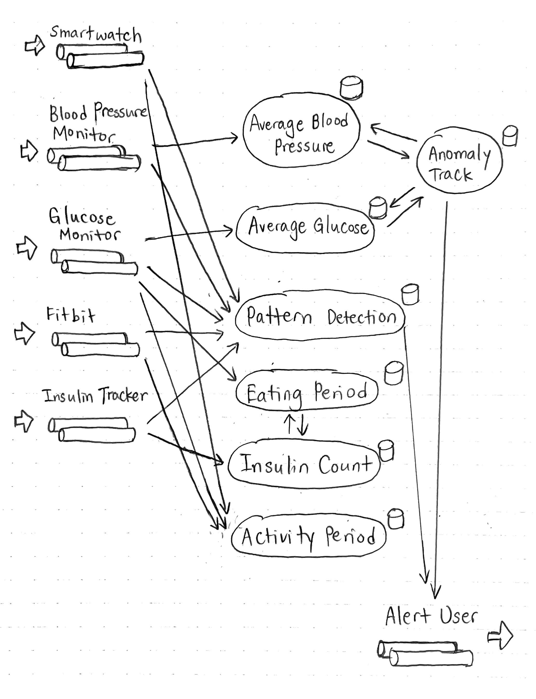

# CAS CS 551 #

# Team 4 Project Proposal #

## 1. Problem Statment ##

##### Introduction to Streaming Analytics and Medical Technology ####
In the recent decade, real-time streaming analytics technology has dramatically improved medical analysis. It has resulted in a reduced workload for doctors. In addition, it helps build time efficient healthcare monitoring systems. This is done through the medium of Internet of Things(IoT) and continuous data sourcing from streaming analytics. Dysfunctional or abnormal patterns in patient data can be spotted sooner than traditional methods. This also lowers the costs of healthcare and medical expenses.

##### The Necessity of a Benchmark ####

 The aim of this project is to establish a benchmark system for the transpiring field of digital streaming analytics. This will serve as a baseline for evaluating the performance of an existing or newly developed system. This Stadardisation would:

- ensure that the application satisfies the minimum requirements in terms of response time, concurrent users, and other performance criteria.
- Provide a tool for developers to compare the cost of competitor products for the corresponding level of performance.
- make use of Benchmarking software for defects as an excellent way to uncover weaknesses in systems.
- Assist in providing a better user experience by improving the platform for friendlier  customer/worker interactions.

##### User Impact ####
Aside from assisting the developers to assess their products, this system would beneficial in extremely useful medical cases such as:
- Real Time ICU Monitoring
- Preventive Care- Data streams are used  in a variety of settings, ranging from newborn to - adult internal medicine and neurological applications.
- Affordable Diabetes Management, which is one of the greatest global health threats currently.

## 2. Proposed Solutions ##

The main tools specified for this project are Flink DataStream API and Flink StateFun. We will implement the benchmark of 4 queries through them and compare their runtime. The primary programming language for this project is Java.

#### Data Generator ####

We plan to implement several kinds of data generators for different devices. These generators are able to provide random data based on required schema on the fly. By configure a set of hyperparameters, we can control generator's behavior, like emission frequency and in/out of order. During the whole data steaming processing, data will be stored into disk in different stages, like original input, slicing windows, join operation and final result. In this way, we can check the sanity of our implementation, like whether we are slicing windows right and giving the correct aggregate result. We will remove these writing operations in benchmark in order to avoid their impacts on performance.

#### Flink DataStream API ####

The implementation of the queries can be done through Flink operators. When running queries, we can use the Filter operator to skip the redundant or unqualified columns and entries. The 1st query is to compute the average blood pressure over activity periods. The activity period can be deduced from heart rate and steps. So here we need to combine data streams from multiple sources. We can use Interval Join with patientID or deviceID as the key.

The 2nd query is to detect abnormal blood pressure and glucose. This can be done using the Window operator which groups the data according to specified attributes. We need 3 windows (e.g., window size can be 10 seconds in terms of timestamp) to keep track on. Suppose the data source is the glucose monitor, its “minute” attribute can be used as timestamp, so some tuples are grouped since their timestamps fall in the range of the first 10 seconds, and there are 2 more groups like this for the following 20 seconds. To compute the average glucose value for a window, the aggregation function can be defined through the Window Apply operator. For anomaly detection, we can write related messages to local files to simulate alert generations.

The 3rd and 4th queries concern about identifying event patterns, which requires processing combined multi-source data streams as well. Here the alert threshold can be in terms of time, therefore the Window operator can be used here as well. For configuring queries (as in the 4th query), we can define our own standards for anomaly detections and pass them as arguments for the methods.

#### Flink Stateful Functions ####

Differing from DataStream API, the Stateful Functions keep local state in each function and allows functions to dynamically communicate with each other. This provides persistency, concurrency, and guaranteed reliable messaging. The database we are using is RocksDB, providing key-value store and allowing schema-free usage. To implement our 4 queries with event-driven Stateful Functions, we can define different functions, each tracking its own state.

- Query 1 implementation - aggregations

>**Average Blood Pressure Function**
>
>This function calculates average Blood Pressure for each device. The event ingress is a stream of “Blood Pressure Monitor” events. When a new event arrives, the function computes new average value of a specific activity, and updates local datastore. To calculate average value, we keep track of current sum and current count of events, and compute average. To prepare for Query 2, we also keep track of the 3 past consecutive windows and the current window average. We will group events by the timeframe in which the events arrived. We could keep track of a queue of events in the current event window, and update the average of current window.

- Query 2 implementation - anomaly detection

>**Average Glucose Function**
>
>Similar to “Average Blood Pressure Function”, we keep track of a list of averages for the past 3 consecutive windows and the average of the current window for glucose.

>**Anomaly Track Function**
>
>This function messages “Average Blood Pressure Function” and “Average Glucose Function” to get the average values and compares past 3 averages with current average. If the difference between the two values is too high, the function emits an alert event to the “Alert User” egress.

- Query 3 implementation - pattern detection

>**Pattern Detection Function**
>
>As events flow in from “Smartwatch”, “Blood Pressure Monitor”, “Glucose Monitor”, “Fitbit”, and “Insulin Tracker”, this function keeps track of recent events from each device and identifies patterns. If a sequence of event pattern occurs, the function emits an alert event to the “Alert User” egress.

- Query 4 implementation - identify eating period

>**Eating Period Function**
>
>As events flow in from “Glucose Monitor”, this function keeps track of a queue of (glucose value, minute). As a new event arrives, check if the new event is within y minutes of the event that is on top of the queue. If it is, the function calculates percent change and identifies if it is an eating period. If the new event is not within y minutes of the event, we pop the event on the top of the queue. For the state, we keep track of a list of time periods that are eating periods.

>**Insulin Count Function**
>
>As events flow from “Insulin Tracker”, this function messages the “Eating Period Function” to get the eating periods. The function keeps track of the count of insulin events within 15 minutes of the start of the eating periods.

>**Activity Period Function**
>
>As events flow in from “Smartwatch” and “Fitbit”, this function keeps track of the heart rate / steps activities from each device and identifies patterns. At the same time, as events come from “Glucose Monitor”, compute glucose activity during activity and inactivity periods.

## 3. Expectations ##

After the project is implemented and its functionality is confirmed, we expect that a significant performance difference between the two implementations can be observed when varying the input parameters. In particular, we propose the following hypotheses:
- Since StateFun requires the stateful functions to send messages to each other in order to progress stream processing, if all the other conditions remain the same, then the latency of StateFun is likely to be higher than that of DataStream API.
- For DataStream API, when new operators are created to run subtasks of queries, we basically have more new instances of these objects, which may consume more memory resources. Therefore, if we increase the quantity of operators (e.g., more window operator instances), the throughput of DataStream would be lower than that of StateFun.

## 4. Experimental Plan ##

We plan to use the same dataset for both methods so that the result of the simulation will not be affected by the difference of input data. There are two ways that we think of to get the input data. The first being randomly generated data by ourselves and the second being the real medical data from online sources. Random data is easy to work with and we will be able to control the variables by ourselves. Real data will make the result of our simulation closer to the real world scenario. We will make our final decision during production.

In this project, we are going to compare the DataStream API of Apache Flink and event-driven Stateful Functions with 2 metrics: 1) latency and 2) throughput. They will use the same data to compare the performance of the two tools. We will conduct 3 experiments each with a varying parameter: 1) Frequency of data emission, 2) Input distributions (uniform & exponential), and 3) Window size (e.g. 10s or 1 minute per window). The collected data will be compared directly to verify our hypothesis.

## 5. Success Indicators ##

*1.Data Source*

The data generator for multiple devices can sends data in required format correctly and be configured with (1) different input distributions, such as in order and out of order, in uniform and exponential and (2) different frequencies of data emission.

*2.Query*

The required set of queries are implemented in DataStream API of Apache Flink and event-driven Statefun Functions. Both of them can process queries properly and output results with high accuracy. As mentioned above, the data generated is simultaneously stored in files to verify the results. The difference between the results produced by our system and the results from the files is measured. The lesser this measure of error is, the higher is the accuracy of the system. The aim is to maximize this accuracy.

*3.Benchmark*

The benchmark is able to evaluate the performance of the two implements of queries in terms of throughput, latency, accuracy and runtime with various input data precisely.

## 6. Task Assignment ##

The project can be broken down into three main parts:
- Input generation (researching to obtain data or writing functions to generate data)
- Data processing with two tools (implementing DataStream API operators and StateFun functions)
- Performance result collecting (plotting graphs and evaluating the outcomes)

Each part depends on the previous one. So we decide to finish these tasks one by one. 
For input generation, there are five input sources and we will each pick one to work with.
For Data processing, we will split into two group to work on the two model in parallel to save time.
For performance collecting, we will keep the two group since people who build the model is the one most familiar with it. Team members will be picking up tasks by their strength. 
